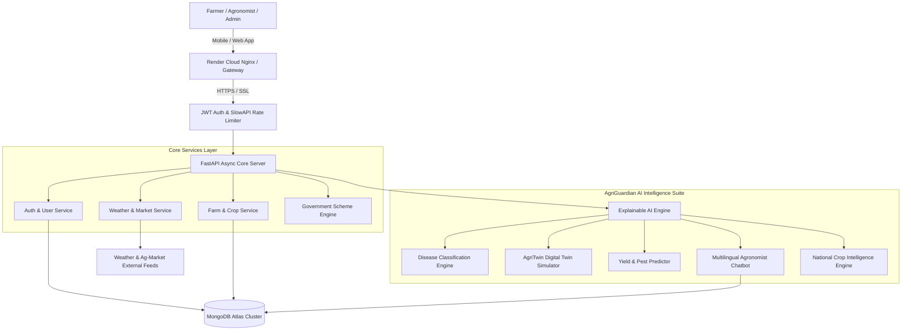
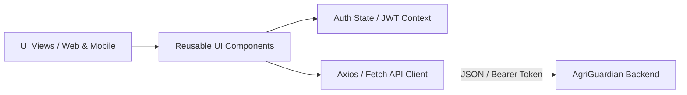
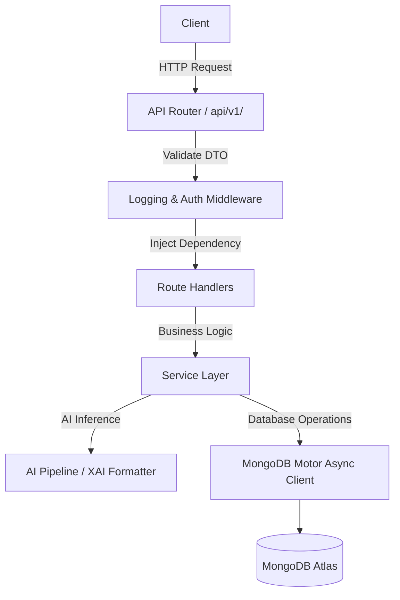
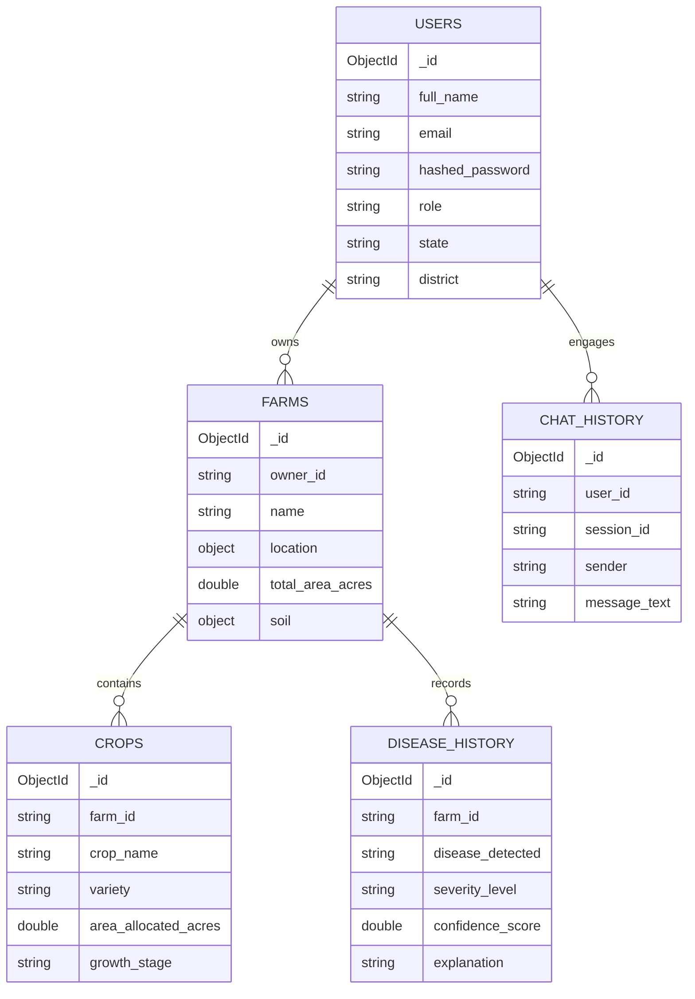
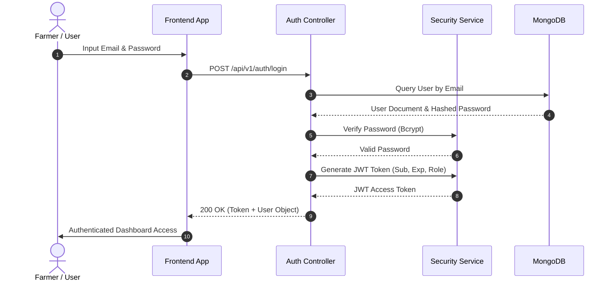
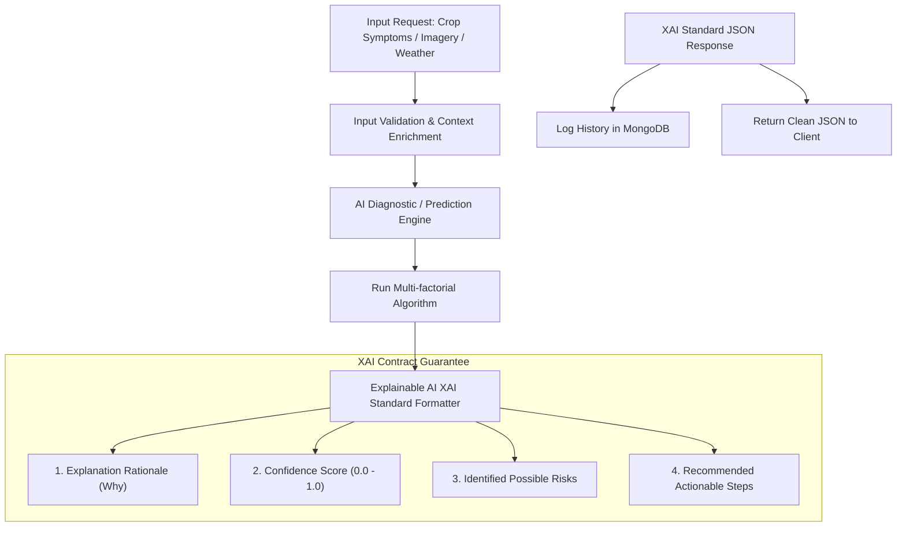
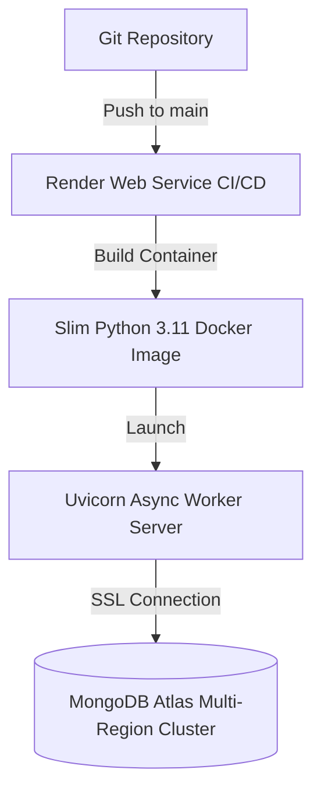

# System Design Architecture - AgriGuardian AI

---

## 🌐 1. High-Level Architecture

AgriGuardian AI is designed using **Clean Architecture** and **Domain-Driven Design (DDD)** principles to ensure scalability, fault isolation, and high performance.



---

## 🎨 2. Frontend Architecture

The frontend (Web / Mobile PWA) follows a component-driven pattern with state management:



---

## ⚡ 3. Backend Architecture

The backend implements a 3-tier modular architecture separating Routing, Services, and Data Access:



---

## 🗄️ 4. Database Schema (MongoDB Collections)



---

## 🔐 5. Authentication Flow



---

## 🤖 6. AI Workflow & Explainable AI (XAI) Pipeline



---

## 📂 7. Project Folder Structure

```
c:\Users\SHALONI\OneDrive\Documents\AgriGuardian-AI\
├── app/
│   ├── api/
│   │   ├── routes/
│   │   │   ├── agritwin.py
│   │   │   ├── auth.py
│   │   │   ├── chatbot.py
│   │   │   ├── crops.py
│   │   │   ├── disease.py
│   │   │   ├── farms.py
│   │   │   ├── market.py
│   │   │   ├── national_intelligence.py
│   │   │   ├── predictions.py
│   │   │   ├── schemes.py
│   │   │   ├── users.py
│   │   │   └── weather.py
│   │   └── router.py
│   ├── ai/
│   │   ├── agritwin_engine.py
│   │   ├── chatbot_engine.py
│   │   ├── disease_detector.py
│   │   ├── explainable_ai.py
│   │   ├── national_intel.py
│   │   ├── pest_predictor.py
│   │   └── yield_predictor.py
│   ├── config/
│   │   └── settings.py
│   ├── database/
│   │   └── mongodb.py
│   ├── middleware/
│   │   ├── logging_middleware.py
│   │   └── rate_limiter.py
│   ├── models/
│   │   ├── chat.py
│   │   ├── common.py
│   │   ├── crop.py
│   │   ├── disease.py
│   │   ├── farm.py
│   │   ├── recommendation.py
│   │   ├── scheme.py
│   │   ├── user.py
│   │   └── weather.py
│   ├── services/
│   │   ├── auth_service.py
│   │   ├── chat_service.py
│   │   ├── crop_service.py
│   │   ├── farm_service.py
│   │   ├── market_service.py
│   │   ├── scheme_service.py
│   │   ├── user_service.py
│   │   └── weather_service.py
│   └── utils/
│       ├── exceptions.py
│       ├── logger.py
│       └── security.py
├── docs/
│   └── SYSTEM_DESIGN.md
├── .env
├── .env.example
├── .gitignore
├── docker-compose.yml
├── Dockerfile
├── main.py
├── README.md
├── render.yaml
└── requirements.txt
```

---

## 🚀 8. Deployment Architecture


